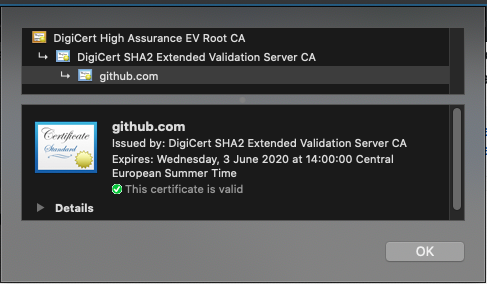

# Certificate Pinning


- [Step 1: Obtain your Public Key certificate](#step-1-obtain-your-public-key-certificate)
- [Step 2: Create a BKS file](#step-2-create-a-bks-file)
- [Step 3: Apply Certificate pinning to OkHttp Client](#step-3-apply-certificate-pinning-to-okhttp-client)

## Step 1: Obtain your Public Key certificate

Go to your endpoint (api.sample.com or sample.com, wherever you want to do SSL pinning) from your browser and click on the green lock icon > certificate.



Then drag and drop certificate icon to your desktop. Done. You have a public certificate.

## Step 2: Create a BKS file

You need to download bouncy castle jar to create BKS file. The bouncy castle is a crypto API.

You can download the latest release from [here](http://www.bouncycastle.org/latest_releases.html).
Now you can create your BKS file using keytool and bouncy castle provider.

```console
keytool -importcert -v -trustcacerts -file "[YOUR_PUBLIC_CERTIFICATE_PATH]" -alias [YOUR_ALIAS] -keystore "[BKS_TARGET_PATH]" -provider org.bouncycastle.jce.provider.BouncyCastleProvider -providerpath "[BOUNCY_CASTLE_JAR_PATH]" -storetype BKS -storepass [YOUR_PASSWORD]
```

For example;

```console
keytool -importcert -v -trustcacerts -file "/Users/dtunctuncer/Documents/pinning/app.tallyattendance.com.cer" -alias tallyattendance1 -keystore "/Users/dtunctuncer/Documents/pinning/certificate.bks" -provider org.bouncycastle.jce.provider.BouncyCastleProvider -providerpath "/Users/dtunctuncer/Documents/pinning/bcprov-jdk15to18-164.jar" -storetype BKS -storepass pZ95Ze0NE6UmoRAIrywQ3qiIPqg2BML+
```

This command will create a BKS file with your public certificate.

If you want to add multiple certificates, run this command with your another public certificate. This command will check the target path and add the new certificate to the existing BKS file so that BKS file will have both certificates inside.

```console
keytool -importcert -v -trustcacerts -file "/Users/dtunctuncer/Documents/pinning/api.sample.com1.cer" -alias certificate1 -keystore "/Users/dtunctuncer/Documents/pinning/certificate.bks" -provider org.bouncycastle.jce.provider.BouncyCastleProvider -providerpath "/Users/dtunctuncer/Documents/pinning/bcprov-jdk15to18-164.jar" -storetype BKS -storepass mypassword
keytool -importcert -v -trustcacerts -file "/Users/dtunctuncer/Documents/pinning/api.sample.com2.cer" -alias certificate2 -keystore "/Users/dtunctuncer/Documents/pinning/certificate.bks" -provider org.bouncycastle.jce.provider.BouncyCastleProvider -providerpath "/Users/dtunctuncer/Documents/pinning/bcprov-jdk15to18-164.jar" -storetype BKS -storepass mypassword
```

> **You should use the different alias name for certificates**

To check if the BKS file has 2 certificates. You can run this command

```console
keytool -list -keystore "/Users/dtunctuncer/Documents/pinning/certificate.bks" -provider org.bouncycastle.jce.provider.BouncyCastleProvider -providerpath "/Users/dtunctuncer/Documents/pinning/bcprov-jdk15to18-164.jar" -storetype BKS -storepass mypassword
```

It will show you the public certificates inside BKS file.


## Step 3: Apply Certificate pinning to OkHttp Client

Add your BKS file to res/raw folder. You can use this helper class for OkHttp

```kotlin
class CertificatePinner @Inject constructor(
        context: Context,
        @RawRes
        private val certificate: Int,
        private val certificatePassword: String
) : OkHttpCertificatePinner {

    private val context: Context = context.applicationContext

    private val trustedCertificate: KeyStore?
        get() {
            var trusted: KeyStore? = null
            try {
                trusted = KeyStore.getInstance(CERTIFICATE_TYPE)
                val inputStream = context.resources.openRawResource(certificate)
                inputStream.use { stream ->
                    trusted.load(stream, certificatePassword.toCharArray())
                }
            } catch (e: Exception) {
                when (e) {
                    is KeyStoreException -> Timber.e(e)
                    is CertificateException -> Timber.e(e)
                    is NoSuchAlgorithmException -> Timber.e(e)
                    is IOException -> Timber.e(e)
                    else -> throw e
                }
            }
            return trusted
        }

    override fun pinCertificate(okhttpBuilder: OkHttpClient.Builder): OkHttpClient.Builder {
        val trustManagerFactory = getTrustManagerFactory(trustedCertificate) ?: return okhttpBuilder
        val sslContext = getSSLContext(trustManagerFactory) ?: return okhttpBuilder
        val trustManager = getX509TrustManager(trustManagerFactory)
        okhttpBuilder.sslSocketFactory(sslContext.socketFactory, trustManager)
        return okhttpBuilder
    }

    private fun getTrustManagerFactory(trustedCertificate: KeyStore?): TrustManagerFactory? {
        var trustManagerFactory: TrustManagerFactory? = null
        try {
            trustManagerFactory = TrustManagerFactory.getInstance(TrustManagerFactory.getDefaultAlgorithm())
            trustManagerFactory.init(trustedCertificate)
        } catch (e: Exception) {
            when (e) {
                is NoSuchAlgorithmException -> Timber.e(e)
                is KeyStoreException -> Timber.e(e)
                else -> throw e
            }
        }
        return trustManagerFactory
    }

    private fun getSSLContext(trustManagerFactory: TrustManagerFactory): SSLContext? {
        var sslContext: SSLContext? = null
        try {
            sslContext = SSLContext.getInstance(DEFAULT_TLS_VERSION)
            sslContext.init(null, trustManagerFactory.trustManagers, null)
        } catch (e: Exception) {
            when (e) {
                is NoSuchAlgorithmException -> Timber.e(e)
                is KeyManagementException -> Timber.e(e)
                else -> throw e
            }
        }
        return sslContext
    }

    private fun getX509TrustManager(trustManagerFactory: TrustManagerFactory): X509TrustManager {
        val trustManagers = trustManagerFactory.trustManagers

        check(!(trustManagers == null
                || trustManagers.size != 1
                || trustManagers[0] !is X509TrustManager)) { "Wrong trust manager: " + Arrays.toString(trustManagers) }

        return trustManagers[0] as X509TrustManager
    }

    companion object {
        private const val CERTIFICATE_TYPE = "BKS"
        private const val DEFAULT_TLS_VERSION = "TLSv1.2"
    }
}
```

Here is the example

```kotlin
val pinner = CertificatePinner(context, R.raw.certificate, "pZ95Ze0NE6UmoRAIrywQ3qiIPqg2BML+")
val builder = OkHttpClient.Builder()
pinner.pinCertificate(builder)

return new Retrofit.Builder()
        .client(builder.build())
        ...
        .build()

```

If you want your implementation to be more secure you can hide your password string into the native code.

- create a folder named jni `src/main/jni`
- create a file named `Android.mk` under jni folder

```
LOCAL_PATH := $(call my-dir)
include $(CLEAR_VARS)
LOCAL_MODULE    := keys  
LOCAL_SRC_FILES := keys.c
include $(BUILD_SHARED_LIBRARY)
```

- create file named `Application.mk`. Information about this file can be found [here](https://developer.android.com/ndk/guides/application_mk)

```
APP_ABI := all
APP_STL := c++_shared
```

- Create the C/C++ file “keys.c” under “jni” folder. Add the following content to it:

```
#include <jni.h>

JNIEXPORT jstring JNICALL
Java_com_sample_app_rest_injection_ApiModule_getCertificatePassword(JNIEnv *env,
                                                                            jobject instance) {

    return (*env)->NewStringUTF(env,
                                "pZ95Ze0NE6UmoRAIrywQ3qiIPqg2BML+");
}
```

Java_com_tally_tallyapp_rest_injection_ApiModule_getCertificatePassword represents the Java code with package name `com.sample.app.rest.injection`

dot(.) must be replaced with underscore(_) `ApiModule` is the class where we want to call the native code. `getCertificatePassword` is the native method.

So if you merge them together **{Package Name}_ {Class Name}_{Method Name}**

- In ApiModule class we have to load the keys module

```kotlin
    init {
        System.loadLibrary("keys")
    }
```

- We have to add member method to access to native method

```kotlin
    external fun getCertificatePassword(): String
```

- To compile native code you have to add this block the build.gradle

```groovy
android {
    .....
    buildTypes {
        .....
    }
    externalNativeBuild {
        ndkBuild {
            path 'src/main/jni/Android.mk'
        }
    }
}
```
