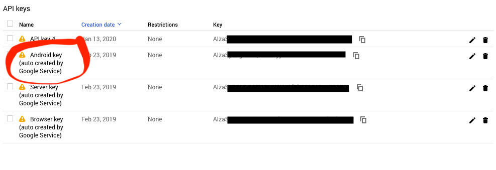

# SafetyNet


SafetyNet on Android provides a set of services and APIs that help protect your app against rooted devices, security threats, including device tampering, bad URLs, potentially harmful apps, and fake users.

## Setup

To use SafetyNet, you need Google Project API Token, which will be likely provided by QA. Heres a quick overview of how you can get one:

1. Go to <https://console.developers.google.com/apis/library>
2. Search for and select the Android Device Verification . The Android Device Verification API dashboard screen appears.
3. If the API isn't already enabled, click Enable.
4. If the Create credentials button appears, click on it to generate an API key. Otherwise, click the All API credentials drop-down list, then select the API key that's associated with your project that has enabled the Android Device Verification API.


5. In the sidebar on the left, click Credentials. Copy the API key that appears.



> Consider following [this guide](./full-code-obfuscation.md) to hide this API key inside the APK.

Add SafetyNet  dependency  to you app-level build.gradle and sync the project. Now you are able to request a SafetyNet attestation that provides an integrity verdict.

```groovy
implementation 'com.google.android.gms:play-services-safetynet:17.0.0'
```

## Request a SafetyNet attestation

Before firing a request, it is recommended to check whether or not the device got the latest Google Play Services version installed:

```kotlin
if(GoogleApiAvailability.getInstance().isGooglePlayServicesAvailable(context)== ConnectionResult.SUCCESS) {
  // The SafetyNet Attestation API is available.
} else {
  // Prompt user to update Google Play services.
}
```

### Nonce

First, you need to create a  nonce, that will be associated with the request, make sure that it is at least 16 byte long a more or less random so it can't be replicated or used twice. Best case scenario it derived from active session data and pulled from the backend.

```kotlin
// Nonce generation example:
val nonce = ByteArray(32)
SecureRandom().nextBytes(byteArray)
```

### Attestation Request

Now, using the nonce  and the API Key you can request the attestation.
Important: The default quota allotment (per project) for calling the SafetyNet Attestation API is 10,000 requests per day.

```kotlin
 SafetyNet.getClient(requireActivity()).attest(nonce,API_KEY).addOnSuccessListener { -> response
 // Response will contain JWS response
 val jwsResult = response.jwsResult
}
```

Now it's time to decode this response and determine whether or not the the device and your app is secure. It is usually the backend that does the verification because of the security reasons, but if you wish to do some simple check inside the app itself, here is what you need to know.

The jwsResult you get in the attestation response is basically three Base64 strings concatenated together using `.` symbol. The second string is the actual payload containing interesting stuff. After decoding the payload you receive a simple json string which can then deserialized into a POJO. Here is the example of retrieving this payload using `Gson`

```kotlin
private fun parseJsonWebSignature(jwsResult: String?): SafetyNetResponse? {
    jwsResult ?: return null
    val parts = jwsResult.split(".")
    return if (parts.size == 3) {
        //we're only really interested in the body/payload
        val decodedPayload = String(Base64.decode(jwtParts[1], Base64.DEFAULT))
        Gson().fromJson<SafeResponse>(decodedPayload)
    } else {
        null
    }
}
```

The payload itself looks like this:

```kotlin
data class SafetyNetResponse(
    val timestampMs: Long,
    val nonce: String,
    val apkDigestSha256: String,
    val apkPackageName: String,
    val apkCertificateDigestSha256: List<String>,
    val ctsProfileMatch: Boolean = false,
    val basicIntegrity: Boolean = false,
    val advice: List<String>? = null
)
```

Properties that provide info about device and app integrity are Boolean flags:

- `ctsProfileMatch`: A stricter verdict of device integrity. If the value of ctsProfileMatch is true, then the profile of the device running your app matches the profile of a device that has passed Android compatibility testing.
- `basicIntegrity`: A more lenient verdict of device integrity. If only the value of basicIntegrity is true, then the device running your app likely wasn't tampered with. However, the device hasn't necessarily passed Android compatibility testing.
- `advice`: List with the strings that explain why either of the flags set to false.

## More info

1. Google docs <https://developer.android.com/training/safetynet/attestation>
2. Sample code: <https://github.com/googlesamples/android-play-safetynet>
